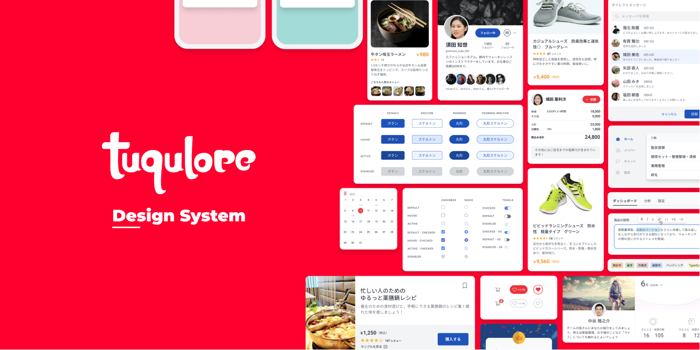

# チャット

複数の人のやりとりを、時系列で見せる場面です。

## 設計の指針

誰の発言かを、**位置や色だけで示さない**でください。
左右の振り分けは目で見る利用者にしか伝わりません。
発言者の名前を添えるか、`aria-label` で補います。

[Balloon](/components/balloon) には `max-w-*` で幅の上限を与えます。
長い発言が画面いっぱいに伸びると、読む距離が長くなります。

新しい発言が届くことを伝えるには、`aria-live` の指定が必要です。

## 例

### 文字のやりとり

:::raw

<div class="container max-w-2xl">
  <div class="mb-4 flex">
    <div class="jumpu-avatar flex-shrink-0 mr-4">
      <a href="#">
        
      </a>
    </div>
    <div>
      <div class="flex items-center mb-2">
        <div class="font-bold mr-4"><a href="#">城田 亜利沙</a></div>
        <div class="text-xs">9:15</div>
      </div>
      <div class="jumpu-balloon">
        オッケー 👍
        13時からオンラインのミーティングなのでそのまえにちょっと話そうか
        😃
      </div>
    </div>
  </div>
</div>

:::

```html
<div class="container max-w-2xl">
  <div class="mb-4 flex">
    <div class="jumpu-avatar mr-4 flex-shrink-0">
      <a href="#">
        
      </a>
    </div>
    <div>
      <div class="mb-2 flex items-center">
        <div class="mr-4 font-bold"><a href="#">城田 亜利沙</a></div>
        <div class="text-xs">9:15</div>
      </div>
      <div class="jumpu-balloon">
        オッケー 👍
        13時からオンラインのミーティングなのでそのまえにちょっと話そうか 😃
      </div>
    </div>
  </div>
</div>
```

### 画像を送る

:::raw

<div class="container max-w-2xl">
  <div class="mb-4 flex">
    <div class="jumpu-avatar shrink-0 mr-4">
      <a href="#">
        
      </a>
    </div>
    <div>
      <div class="flex items-center mb-2">
        <div class="font-bold mr-4"><a href="#">城田 亜利沙</a></div>
        <div class="text-xs">9:15</div>
      </div>
      <div
        class="flex items-center border border-gray-300 rounded-lg overflow-hidden"
      >
        <a href="#" class="w-32 h-32 shrink-0">
          
        </a>
        <div class="px-4 py-3">
          <a href="#" class="mb-1 font-bold block hover:underline"
            >つくり・つたえるUIデザイン | 株式会社ツクロア</a
          >
          <div class="mb-2 text-sm text-gray-700">
            人の行動と心を理解しプロジェクトの成長を支援するUIデザイン・アドバイザー
          </div>
          <div
            class="text-xs text-gray-500 leading-none flex items-center"
          >
            
            <a href="#">tuqulore.com</a>
          </div>
        </div>
      </div>
    </div>
  </div>
</div>

:::

```html
<div class="container max-w-2xl">
  <div class="mb-4 flex">
    <div class="jumpu-avatar mr-4 shrink-0">
      <a href="#">
        
      </a>
    </div>
    <div>
      <div class="mb-2 flex items-center">
        <div class="mr-4 font-bold"><a href="#">城田 亜利沙</a></div>
        <div class="text-xs">9:15</div>
      </div>
      <div
        class="flex items-center overflow-hidden rounded-lg border border-gray-300"
      >
        <a href="#" class="h-32 w-32 shrink-0">
          
        </a>
        <div class="px-4 py-3">
          <a href="#" class="mb-1 block font-bold hover:underline"
            >つくり・つたえるUIデザイン | 株式会社ツクロア</a
          >
          <div class="mb-2 text-sm text-gray-700">
            人の行動と心を理解しプロジェクトの成長を支援するUIデザイン・アドバイザー
          </div>
          <div class="flex items-center text-xs leading-none text-gray-500">
            
            <a href="#">tuqulore.com</a>
          </div>
        </div>
      </div>
    </div>
  </div>
</div>
```
