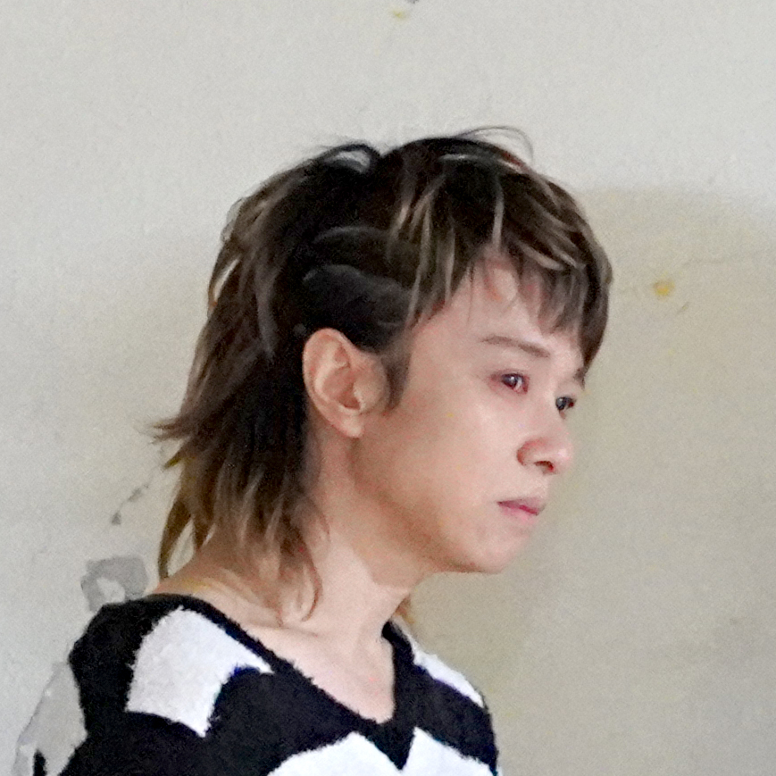

# ProfileCard {class="!mb-8"}

:::raw

<div class="flex">
  <div class="jumpu-card w-80 mr-4">
    <div class="h-32 bg-center bg-cover bg-[url(/bg.example.jpg)]"></div>
    <div class="relative py-2 px-4 flex justify-end align-center">
      <div
        class="jumpu-avatar absolute left-4 -top-10 border-4 border-white w-20 h-20"
      >
        
      </div>
      <div class="flex align-center gap-2">
        <button
          type="button"
          class="jumpu-icon-button"
          aria-describedby="tooltip-envelope"
        >
          <i class="fas fa-envelope"></i>
          <span id="tooltip-envelope" role="tooltip">メール</span>
        </button>
        <button
          type="button"
          class="jumpu-icon-button"
          aria-describedby="tooltip-etc"
        >
          <i class="fas fa-ellipsis-h"></i>
          <span id="tooltip-etc" role="tooltip">その他</span>
        </button>
      </div>
    </div>
    <div class="px-4 flex justify-between items-end">
      <div>
        城田 亜利沙
        <div class="text-xxs text-gray-600">@shirota_arisa</div>
      </div>
      <div class="flex">
        <div class="text-center text-sm mr-4">
          1480
          <div class="text-xxs text-gray-600">フォロワー</div>
        </div>
        <div class="text-center text-sm">
          80
          <div class="text-xxs text-gray-600">フォロー</div>
        </div>
      </div>
    </div>
    <div class="px-4 py-4 text-sm">
      元ファッションモデル。都内でウォーキンレッスンのインストラクターをしています。お仕事のご依頼はDMまで。
    </div>
    <div class="px-4 mb-4 flex">
      <a href="#" class="jumpu-avatar border-2 border-white w-10 h-10">
        
      </a>
      <a
        href="#"
        class="jumpu-avatar -ml-2 border-2 border-white w-10 h-10"
      >
        
      </a>
      <a
        href="#"
        class="jumpu-avatar -ml-2 border-2 border-white w-10 h-10"
      >
        
      </a>
      <a
        href="#"
        class="jumpu-avatar -ml-2 border-2 border-white w-10 h-10"
      >
        
      </a>
      <a
        href="#"
        class="jumpu-avatar -ml-2 border-2 border-white w-10 h-10"
      >
        
      </a>
    </div>
    <div class="mb-4 px-4 text-gray-500 text-xs">
      marieさん、DLOさん、Kateさん…他3人がフォロー中
    </div>
  </div>
  <div class="jumpu-card w-80">
    <div
      class="h-32 bg-center bg-cover bg-gradient-to-r from-purple-400 via-pink-500 to-red-500"
    ></div>
    <div class="relative py-2 px-4 flex justify-end align-center">
      <div
        class="jumpu-avatar absolute left-4 -top-10 border-4 border-white w-20 h-20"
      >
        
      </div>
      <div class="flex align-center gap-2">
        <button
          type="button"
          class="jumpu-icon-button"
          aria-describedby="tooltip-envelope"
        >
          <i class="fas fa-envelope"></i>
          <span id="tooltip-envelope" role="tooltip">メール</span>
        </button>
        <button
          type="button"
          class="jumpu-icon-button"
          aria-describedby="tooltip-etc"
        >
          <i class="fas fa-ellipsis-h"></i>
          <span id="tooltip-etc" role="tooltip">その他</span>
        </button>
      </div>
    </div>
    <div class="px-4 flex justify-between items-end">
      <div>
        秋葉 秀樹
        <div class="text-xxs text-gray-600">@hidetaro7</div>
      </div>
      <div class="flex">
        <div class="text-center text-sm mr-4">
          1480
          <div class="text-xxs text-gray-600">フォロワー</div>
        </div>
        <div class="text-center text-sm">
          80
          <div class="text-xxs text-gray-600">フォロー</div>
        </div>
      </div>
    </div>
    <div class="px-4 py-4 text-sm">
      クリエイター・デザイナー。アングラな音楽ユニット、ニューロナのサウンドクリエイター。本業はUX・UI、デザインエンジニアですが仕事関係は
      @tuqulore にて。
    </div>
    <div class="px-4 mb-4 flex">
      <a href="#" class="jumpu-avatar border-2 border-white w-10 h-10">
        
      </a>
      <a
        href="#"
        class="jumpu-avatar -ml-2 border-2 border-white w-10 h-10"
      >
        
      </a>
      <a
        href="#"
        class="jumpu-avatar -ml-2 border-2 border-white w-10 h-10"
      >
        
      </a>
      <a
        href="#"
        class="jumpu-avatar -ml-2 border-2 border-white w-10 h-10"
      >
        
      </a>
      <a
        href="#"
        class="jumpu-avatar -ml-2 border-2 border-white w-10 h-10"
      >
        
      </a>
    </div>
    <div class="mb-4 px-4 text-gray-500 text-xs">
      marieさん、DLOさん、Kateさん…他3人がフォロー中
    </div>
  </div>
</div>

:::

```html
<div class="flex">
  <div class="jumpu-card w-80 mr-4">
    <div class="h-32 bg-center bg-cover bg-[url(/bg.example.jpg)]"></div>
    <div class="relative py-2 px-4 flex justify-end align-center">
      <div
        class="jumpu-avatar absolute left-4 -top-10 border-4 border-white w-20 h-20"
      >
        
      </div>
      <div class="flex align-center gap-2">
        <button
          type="button"
          class="jumpu-icon-button"
          aria-describedby="tooltip-envelope"
        >
          <i class="fas fa-envelope"></i>
          <span id="tooltip-envelope" role="tooltip">メール</span>
        </button>
        <button
          type="button"
          class="jumpu-icon-button"
          aria-describedby="tooltip-etc"
        >
          <i class="fas fa-ellipsis-h"></i>
          <span id="tooltip-etc" role="tooltip">その他</span>
        </button>
      </div>
    </div>
    <div class="px-4 flex justify-between items-end">
      <div>
        城田 亜利沙
        <div class="text-xxs text-gray-600">@tomoyo_suda_000</div>
      </div>
      <div class="flex">
        <div class="text-center text-sm mr-4">
          1480
          <div class="text-xxs text-gray-600">フォロワー</div>
        </div>
        <div class="text-center text-sm">
          80
          <div class="text-xxs text-gray-600">フォロー</div>
        </div>
      </div>
    </div>
    <div class="px-4 py-4 text-sm">
      元ファッションモデル。都内でウォーキンレッスンのインストラクターをしています。お仕事のご依頼はDMまで。
    </div>
    <div class="px-4 mb-4 flex">
      <a href="#" class="jumpu-avatar border-2 border-white w-10 h-10">
        
      </a>
      <a href="#" class="jumpu-avatar -ml-2 border-2 border-white w-10 h-10">
        
      </a>
      <a href="#" class="jumpu-avatar -ml-2 border-2 border-white w-10 h-10">
        
      </a>
      <a href="#" class="jumpu-avatar -ml-2 border-2 border-white w-10 h-10">
        
      </a>
      <a href="#" class="jumpu-avatar -ml-2 border-2 border-white w-10 h-10">
        
      </a>
    </div>
    <div class="mb-4 px-4 text-gray-500 text-xs">
      marieさん、DLOさん、Kateさん…他3人がフォロー中
    </div>
  </div>
  <div class="jumpu-card w-80">
    <div
      class="h-32 bg-center bg-cover bg-gradient-to-r from-purple-400 via-pink-500 to-red-500"
    ></div>
    <div class="relative py-2 px-4 flex justify-end align-center">
      <div
        class="jumpu-avatar absolute left-4 -top-10 border-4 border-white w-20 h-20"
      >
        
      </div>
      <div class="flex align-center gap-2">
        <button
          type="button"
          class="jumpu-icon-button"
          aria-describedby="tooltip-envelope"
        >
          <i class="fas fa-envelope"></i>
          <span id="tooltip-envelope" role="tooltip">メール</span>
        </button>
        <button
          type="button"
          class="jumpu-icon-button"
          aria-describedby="tooltip-etc"
        >
          <i class="fas fa-ellipsis-h"></i>
          <span id="tooltip-etc" role="tooltip">その他</span>
        </button>
      </div>
    </div>
    <div class="px-4 flex justify-between items-end">
      <div>
        秋葉 秀樹
        <div class="text-xxs text-gray-600">@hidetaro7</div>
      </div>
      <div class="flex">
        <div class="text-center text-sm mr-4">
          1480
          <div class="text-xxs text-gray-600">フォロワー</div>
        </div>
        <div class="text-center text-sm">
          80
          <div class="text-xxs text-gray-600">フォロー</div>
        </div>
      </div>
    </div>
    <div class="px-4 py-4 text-sm">
      クリエイター・デザイナー。アングラな音楽ユニット、ニューロナのサウンドクリエイター。本業はUX・UI、デザインエンジニアですが仕事関係は
      @tuqulore にて。
    </div>
    <div class="px-4 mb-4 flex">
      <a href="#" class="jumpu-avatar border-2 border-white w-10 h-10">
        
      </a>
      <a href="#" class="jumpu-avatar -ml-2 border-2 border-white w-10 h-10">
        
      </a>
      <a href="#" class="jumpu-avatar -ml-2 border-2 border-white w-10 h-10">
        
      </a>
      <a href="#" class="jumpu-avatar -ml-2 border-2 border-white w-10 h-10">
        
      </a>
      <a href="#" class="jumpu-avatar -ml-2 border-2 border-white w-10 h-10">
        
      </a>
    </div>
    <div class="mb-4 px-4 text-gray-500 text-xs">
      marieさん、DLOさん、Kateさん…他3人がフォロー中
    </div>
  </div>
</div>
```
